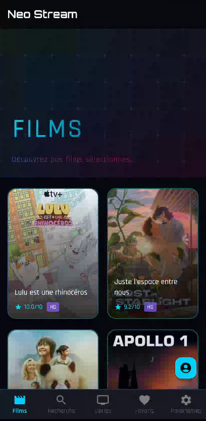
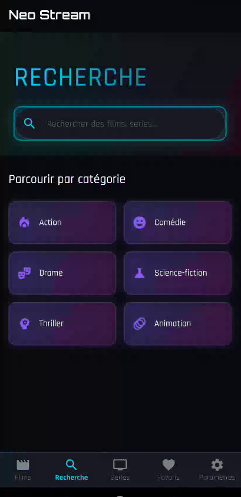
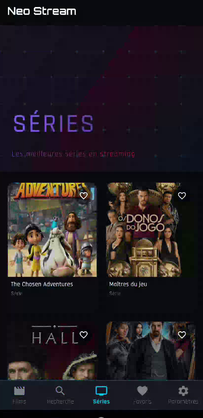
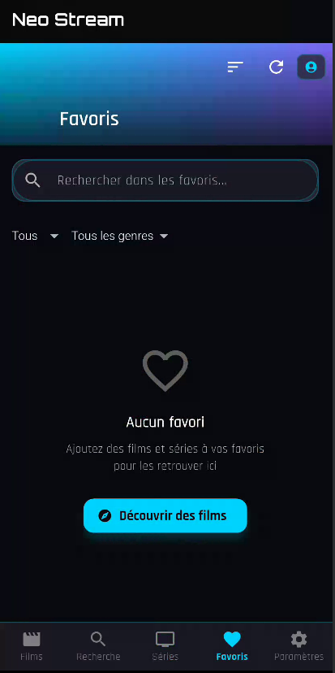
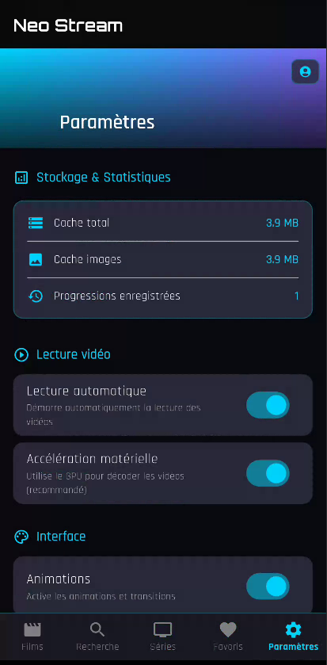
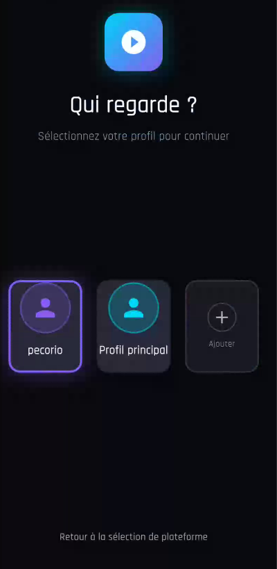

# 🎬 NEO-Stream

<div align="center">


**🌟 L'avenir du streaming est maintenant 🌟**

*Une application de streaming moderne avec une interface cyberpunk néon époustouflante*

[📥 Télécharger](#installation) • [✨ Fonctionnalités](#fonctionnalités) • [🎮 Démo](#-galerie-décran) • [🛠️ Build](#build)

</div>

---

## 🎨 Galerie d'écran

<div align="center">

### Interface Principale

<table>
<tr>
<td width="50%"></td>
<td width="50%"></td>
</tr>
<tr>
<td align="center"><b>🎬 Films</b><br/>Catalogue complet avec recherche</td>
<td align="center"><b>📺 Séries</b><br/>Gestion des saisons et épisodes</td>
</tr>
</table>

### Expérience Utilisateur

<table>
<tr>
<td width="50%"></td>
<td width="50%"></td>
</tr>
<tr>
<td align="center"><b>▶️ Lecteur</b><br/>Contrôles avancés</td>
<td align="center"><b>🔍 Recherche</b><br/>Recherche intelligente</td>
</tr>
</table>

### Gestion des Profils

<table>
<tr>
<td width="50%"></td>
<td width="50%"></td>
</tr>
<tr>
<td align="center"><b>👥 Profils</b><br/>Multi-comptes personnalisés</td>
<td align="center"><b>⭐ Favoris</b><br/>Vos contenus préférés</td>
</tr>
</table>

</div>

---

## 🚀 À propos

**NEO-Stream** est une application de streaming élégante et performante développée avec Flutter. Elle offre une expérience utilisateur futuriste avec un design cyberpunk unique, compatible avec les smartphones Android et les Android TV (incluant Freebox Mini 4K).

### 🎯 Points forts

- 🎨 **Design Cyberpunk** - Interface néon avec animations fluides et transitions élégantes
- 📺 **Multi-plateforme** - Mobile Android, Tablettes & Android TV
- 👥 **Multi-profils** - Gestion de profils utilisateurs avec 12 avatars personnalisés
- 🔍 **Recherche intelligente** - Films et séries avec filtres avancés et déduplication
- ⏯️ **Reprise automatique** - Continuez exactement où vous vous êtes arrêté
- 📊 **Suivi de progression** - Historique de visionnage complet avec timestamps
- ⭐ **Favoris** - Sauvegardez vos contenus préférés par profil
- 🎮 **Navigation TV** - Support complet télécommande D-pad pour Freebox Mini
- 🌐 **Proxy d'images** - Accès aux images même avec restrictions géographiques
- 📱 **Responsive** - Adaptée à tous les types d'écrans

---

## ✨ Fonctionnalités Détaillées

### 📱 Interface Utilisateur
- **Design Material 3** avec thème cyberpunk personnalisé
- **Animations fluides** avec Flutter Animate et Staggered Animations
- **Fonts futuristes** Orbitron & Rajdhani
- **Mode sombre** optimisé avec accents néon cyan/violet
- **Gradients dynamiques** et effets de lueur

### 🎬 Streaming
- **Lecteur vidéo** intégré avec contrôles complets (play, pause, seek, volume)
- **Support des headers** personnalisés pour les streams protégés
- **Extraction automatique** des liens vidéo (UQLoad, etc.)
- **Sauvegarde automatique** de la progression toutes les 10 secondes
- **Gestion des sessions** et cookies
- **DNS Quad9** pour contournement géographique

### 👤 Gestion des Profils
- **Création de profils** multiples
- **12 avatars** personnalisés inclus
- **Données séparées** par profil (favoris, progression, préférences)
- **Protection optionnelle** par question secrète
- **Synchronisation** des profils

### 📺 Support Android TV
- **Navigation D-pad** complète et intuitive
- **Focus visuel** adapté aux grands écrans
- **Clavier virtuel** optimisé TV
- **Compatible Freebox Mini 4K** (Android 7.1+)
- **Contrôle fluide** des listes et grilles

### 🔧 Architecture Technique
- **Riverpod** pour la gestion d'état réactive
- **Freezed** pour les modèles immuables
- **Hive** pour la base de données locale
- **Dio** pour les requêtes HTTP
- **Cached Network Image** avec proxy global
- **Architecture Clean** avec séparation des couches

---

## 📋 Prérequis

- **Flutter SDK** 3.6+
- **Dart SDK** 3.6+
- **Android SDK** (API 25+)
- **Java** (JDK 11+)

---

## 🛠️ Build

### Cloner le projet

```bash
git clone https://github.com/pecorio-dev/Neo-Stream.git
cd Neo-Stream
```

### Installer les dépendances

```bash
flutter pub get
```

### Générer le code (Riverpod, Freezed, Hive)

```bash
dart run build_runner build --delete-conflicting-outputs
```

### Build APK Release

```bash
flutter build apk --release
```

L'APK sera disponible dans `build/app/outputs/flutter-apk/app-release.apk`

### Build APK Debug

```bash
flutter build apk --debug
```

### Build AAB (Google Play)

```bash
flutter build appbundle --release
```

---

## 📥 Installation

### Téléchargement direct

Téléchargez la dernière version depuis:
👉 **[GitHub Releases v1.0.0](https://github.com/pecorio-dev/Neo-Stream/releases/tag/v1.0.0)**

### Installation manuelle

1. Activez "Sources inconnues" dans les paramètres Android
2. Téléchargez le fichier APK depuis les releases
3. Ouvrez le fichier et suivez les instructions
4. Accédez au contenu de streaming

---

## 🏗️ Architecture

```
lib/
├── core/                    # Services et utilitaires de base
│   ├── constants/           # Constantes de l'application
│   ├── design_system/       # Système de couleurs et animations
│   ├── initialization/      # Initialisation de l'app
│   ├── navigation/          # Système de navigation avancé
│   ├── services/            # Services (DNS, Cast, File Sharing)
│   ├── theme/               # Thème Material 3 cyberpunk
│   ├── tv/                  # Support Android TV et focus
│   └── utils/               # Utilitaires et helpers
├── data/                    # Couche données
│   ├── extractors/          # Extracteurs de liens vidéo
│   ├── models/              # Modèles de données (Freezed)
│   ├── repositories/        # Repositories pour les données
│   └── services/            # Services API et stockage local
├── presentation/            # Couche UI (Flutter)
│   ├── providers/           # Providers Riverpod
│   ├── screens/             # Écrans principaux
│   ├── widgets/             # Widgets réutilisables
│   └── animations/          # Animations personnalisées
└── main.dart                # Point d'entrée de l'application
```

---

## 🎨 Palette de Couleurs Cyberpunk

| Couleur | Hex | Usage |
|---------|-----|-------|
| Background Primary | `#0A0A0F` | Fond principal |
| Background Secondary | `#1A1A24` | Fond secondaire |
| Background Tertiary | `#2A2A3A` | Surfaces |
| Neon Cyan | `#00D4FF` | Accent principal - Boutons, Focus |
| Neon Purple | `#8B5CF6` | Accent secondaire - Dégradés |
| Text Primary | `#FFFFFF` | Texte principal |
| Text Secondary | `#B3B3B3` | Texte secondaire |
| Text Tertiary | `#666666` | Texte désactivé |

---

## 📦 Dépendances Principales

| Package | Version | Usage |
|---------|---------|-------|
| `flutter_riverpod` | ^2.4.9 | State management réactif |
| `video_player` | ^2.8.6 | Lecteur vidéo |
| `dio` | ^5.4.0 | Client HTTP |
| `hive_flutter` | ^1.1.0 | Base de données locale |
| `cached_network_image` | ^3.3.1 | Cache d'images |
| `flutter_animate` | ^4.5.0 | Animations fluides |
| `google_fonts` | ^6.1.0 | Polices personnalisées |
| `freezed_annotation` | ^2.4.1 | Modèles immuables |
| `permission_handler` | ^12.0.1 | Gestion des permissions |

---

## 🤝 Contribution

Les contributions sont les bienvenues ! N'hésitez pas à :

1. **Fork** le projet
2. **Créer une branche** (`git checkout -b feature/AmazingFeature`)
3. **Commit** vos changements (`git commit -m 'Add AmazingFeature'`)
4. **Push** sur la branche (`git push origin feature/AmazingFeature`)
5. **Ouvrir une Pull Request**

### Guide de style
- Utilisez des noms descriptifs en français/anglais
- Commentez votre code
- Testez avant de soumettre
- Suivez les conventions Dart

---

## ⚠️ Disclaimer

**Cette application est fournie à des fins éducatives et de démonstration uniquement.**

- L'utilisation de cette application pour accéder à du contenu protégé par le droit d'auteur sans autorisation est interdite
- Les utilisateurs sont responsables de s'assurer qu'ils respectent toutes les lois applicables en matière de droits d'auteur
- L'auteur n'est pas responsable de l'usage fait de cette application

---

## 📄 Licence

Ce projet est sous **licence MIT**. Voir le fichier [LICENSE](LICENSE) pour plus de détails.

**Copyright © 2026 Pecorio Dev** - Tous droits réservés

---

## 👤 Auteur

**Pecorio Dev**

- 🐙 **GitHub:** [@pecorio-dev](https://github.com/pecorio-dev)
- 📧 **Email:** stream2free.pecorio@gmail.com
- 💻 **Portfolio:** Flutter & Dart Developer

---

## 🔗 Ressources

- [Flutter Documentation](https://flutter.dev)
- [Riverpod Guide](https://riverpod.dev)
- [Material Design 3](https://m3.material.io)
- [Android TV Best Practices](https://developer.android.com/training/tv)

---

<div align="center">

### 📊 Statistiques du Projet


---

### 🌟 Si vous aimez ce projet, donnez-lui une étoile !

**Merci pour votre soutien!** ❤️

---


### 🎮 Prêt à découvrir le futur du streaming ? 🚀

</div>

---

## 🔑 Keywords pour SEO

`flutter` `streaming` `android` `android-tv` `video-player` `movies` `series` `cyberpunk` `neon-ui` `dart` `riverpod` `material-design` `open-source` `freebox` `iptv` `media-player` `flutter-app` `streaming-app` `entertainment` `vod` `video-streaming` `mobile-app` `tv-app` `muti-profile` `watch-progress` `favorites` `search-movies` `responsive-design` `clean-architecture` `state-management` `hive-database` `cached-images` `animation-flutter`
