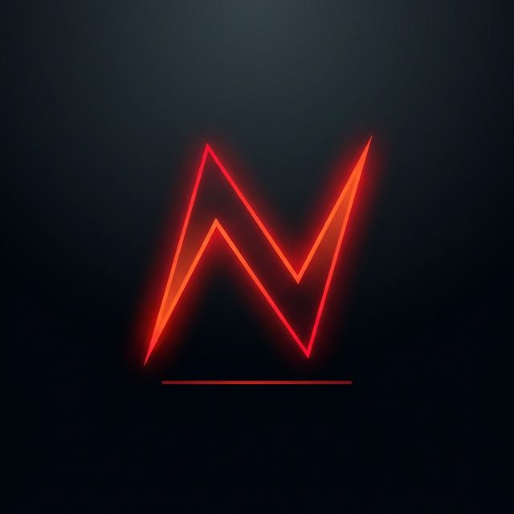
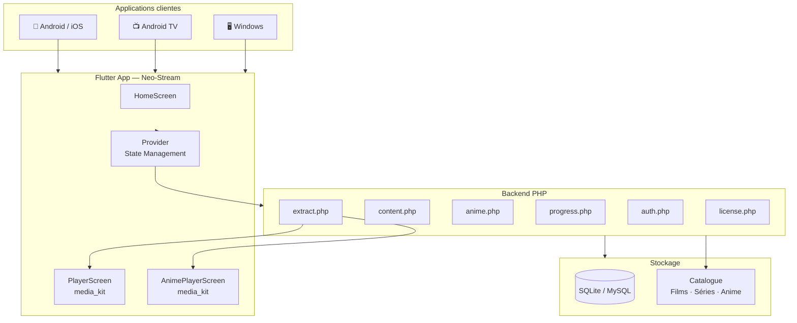
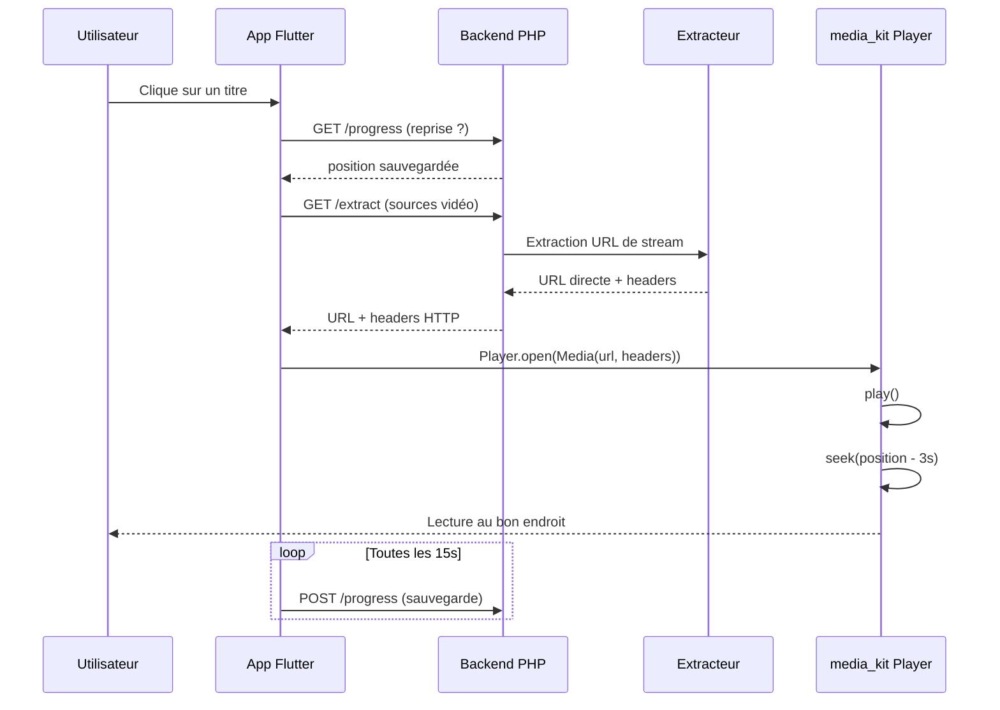

<div align="center">
##windows gratuit pour l'instant##


# NEO-STREAM

**Films · Séries · Anime — 720p & 1080p · Sans pub · Sans abonnement mensuel**

[](https://flutter.dev)
[](https://dart.dev)
[](https://php.net)
[](https://android.com)
[]()
[](https://microsoft.com)

> *Un accès à vie pour 10 €. Une seule fois. Plus jamais.*

</div>

---

## L'histoire derrière le projet

Il y a deux ans, je ne savais pas coder. Zéro. Rien.

J'avais 15 ans, une idée en tête — une vraie plateforme de streaming, propre, sans pub, accessible à tout le monde — et aucun moyen de la construire. Alors j'ai commencé à apprendre. Le vibe coding d'abord, juste pour comprendre ce que faisait le code. Puis le coding à la main, ligne par ligne. Puis l'aide de l'IA pour aller plus vite, débugger, structurer. Deux ans de soirées, de weekends, de recommencements.

Ma mère me répète depuis le début que je perds mon temps. *"Arrête ce projet, ça ne mènera à rien."*

Je n'ai pas arrêté.

Parce que le but de Neo-Stream, c'est simple : **casser les codes**. Pourquoi est-ce que regarder un film doit coûter 13 € par mois, afficher des pubs, exiger un compte, et te bloquer sur une seule plateforme ? J'ai voulu faire autrement. Une contribution minuscule — 10 € une seule fois, à vie — pour accéder à des films, séries et anime en 720p et 1080p, sans interruption publicitaire, sur tous tes appareils.

Je m'appelle **p3cori0**, j'ai **17 ans**, et Neo-Stream est le projet le plus important de ma vie jusqu'ici. Si tu utilises l'app et que tu veux me soutenir dans mon avenir, même juste en laissant une étoile ou en parlant du projet autour de toi — ça compte énormément.

---

## Ce que Neo-Stream propose

| Fonctionnalité | Détail |
|---|---|
| 🎬 Catalogue | Films, séries, anime — organisé, sans bruit |
| 📺 Qualité | 720p standard · 1080p sur les titres compatibles |
| 🚫 Publicités | Aucune. Jamais. |
| ▶️ Reprise automatique | Continue exactement là où tu t'es arrêté, sur tous tes appareils |
| ❤️ Favoris | Films, séries et anime sauvegardés par profil |
| 👤 Multi-profils | Plusieurs profils par compte (sous-comptes) |
| 📱 Multi-plateforme | Android, iOS, TV, Windows — même compte partout |
| 💳 Paiement | **10 € une seule fois — accès à vie, aucun renouvellement** |

---

## Architecture du système


```mermaid
graph TB
    subgraph CLIENT["Applications clientes"]
        A[📱 Android / iOS]
        B[📺 Android TV]
        C[🖥️ Windows]
    end

    subgraph APP["Flutter App — Neo-Stream"]
        D[HomeScreen]
        E[PlayerScreen<br/>media_kit]
        F[AnimePlayerScreen<br/>media_kit]
        H[Provider<br/>State Management]
    end

    subgraph API["Backend PHP"]
        I[auth.php]
        J[content.php]
        K[anime.php]
        L[progress.php]
        M[extract.php]
        N[license.php]
    end


    subgraph DB["Stockage"]
        S[(SQLite / MySQL)]
        T[Catalogue<br/>Films · Séries · Anime]
    end

    A & B & C --> APP
    APP --> H
    H --> API
    API --> DB
    API --> T
    M --> E & F
```

---

## Flux de lecture vidéo


```mermaid
sequenceDiagram
    participant U as Utilisateur
    participant A as App Flutter
    participant API as Backend PHP
    participant EX as Extracteur
    participant P as media_kit Player

    U->>A: Clique sur un titre
    A->>API: GET /progress (reprise ?)
    API-->>A: position sauvegardée
    A->>API: GET /extract (sources vidéo)
    API->>EX: Extraction URL de stream
    EX-->>API: URL directe + headers
    API-->>A: URL + headers HTTP
    A->>P: Player.open(Media(url, headers))
    P->>P: play()
    P->>P: seek(position - 3s)
    P-->>U: Lecture au bon endroit
    loop Toutes les 15s
        A->>API: POST /progress (sauvegarde)
    end
```

---

## Stack technique

```
app/
├── lib/
│   ├── config/          → Thème, constantes, config TV
│   ├── models/          → Content, Anime, User, SubAccount
│   ├── providers/       → ContentProvider, FocusProvider
│   ├── screens/         → 20 écrans (mobile + TV)
│   │   └── tv/          → Interface dédiée TV (navigation D-pad)
│   ├── services/        → ApiService, AnimeExtractor, VideoExtractor
│   ├── utils/           → TVDetector, WatchLinkUtils
│   └── widgets/         → ContentCard, HeroBanner, SectionHeader, Shimmer...
api/
├── auth.php             → JWT, sessions
├── content.php          → Films & séries
├── anime.php            → Anime, saisons, épisodes
├── progress.php         → Reprise multi-appareils
├── extract.php          → Extraction sources vidéo
├── license.php          → Gestion accès à vie
```

**Dépendances Flutter clés :**
- `media_kit` — lecteur vidéo natif cross-platform
- `provider` — gestion d'état
- `cached_network_image` — images avec cache
- `flutter_secure_storage` — tokens sécurisés
- `shimmer` — skeletons de chargement

---

## Plateformes supportées

| Plateforme | Statut | Interface |
|---|---|---|
| Android (5.0+) | ✅ Production | Mobile + Tablet |
| Android TV | ✅ Production | Navigation D-pad complète |
| iOS | 🔧 En développement | Mobile |
| Windows | ✅ Production | Desktop |
| macOS | 🔧 Prévu | Desktop |

---

## Accès & tarif

> **10 € — une seule fois — accès à vie.**

C'est le prix d'un mois sur n'importe quelle autre plateforme. Ici c'est pour toujours.

Le paiement se fait via PayPal depuis l'application. Une fois validé, ton compte est déverrouillé définitivement sur tous tes appareils.

---

## Accès gratuit — contacter p3cori0

Si tu n'as vraiment pas les moyens mais que le projet te parle, tu peux me contacter directement :

**GitHub :** [@p3cori0](https://github.com/p3cori0)

Je décide au cas par cas. Je ne peux pas promettre de dire oui — mais je peux promettre de lire chaque message. Sois honnête, c'est tout ce que je demande.

---

## Contribuer

Le projet n'est pas open source au sens strict — le backend et les sources d'extraction restent privés pour des raisons évidentes. Mais si tu veux contribuer :

- ⭐ **Étoile le repo** — c'est gratuit et ça aide énormément
- 🐛 **Signale un bug** via les Issues GitHub
- 💬 **Parle-en autour de toi** — le meilleur marketing

---

## Pourquoi ce projet me tient à cœur

J'ai 17 ans. Ce projet m'a appris à coder, à architecturer un système complet, à gérer un backend, à comprendre la vidéo, le réseau, l'UI, l'IA. Deux ans de travail en partant de zéro.

Ma mère pense que je perds mon temps. Peut-être qu'elle a raison, peut-être pas. Mais Neo-Stream existe, il tourne, des gens l'utilisent — et ça, personne ne peut me l'enlever.

Si tu supportes le projet, même juste moralement, merci. Ça compte.

---

---

## Mots-clés / Keywords

`streaming gratuit` `streaming sans pub` `regarder films gratuit` `regarder anime gratuit`  
`regarder séries gratuitement` `application streaming française` `alternative Netflix gratuit`  
`streaming VF VOSTFR` `anime VF application` `anime VOSTFR gratuit` `films 1080p gratuit`  
`séries 1080p streaming` `streaming sans abonnement` `streaming abonnement vie`  
`flutter streaming app` `android streaming app` `tv streaming application` `windows streaming`  
`neo stream` `neostream` `streaming pas cher` `10 euros à vie` `accès vie streaming`  
`streaming famille multi-profils` `streaming sans compte Google` `streaming APK android`  
`meilleure app streaming française` `app streaming android tv` `regarder anime francais`

---

<div align="center">

Fait avec trop de café et beaucoup d'obstination par **p3cori0** · 17 ans · France

*"Commence. Le reste vient."*

</div>
