<div align="center">


# Neo-Stream

### Films · Séries · Anime · TV en direct — gratuit, sans pub, multiplateforme

<p>
  <a href="https://github.com/pecorio-dev/Neo-Stream/releases/latest"></a>
  
  
  
  
</p>

<p>
  <a href="https://github.com/pecorio-dev/Neo-Stream/actions/workflows/release.yml"></a>
  <a href="https://github.com/pecorio-dev/Neo-Stream/actions/workflows/build-all.yml"></a>
</p>

<p>
  <a href="https://flutter.dev"></a>
  <a href="https://dart.dev"></a>
  
  
  
  
</p>

<p>
  <a href="https://neo-stream.eu">🌐 Site web</a> ·
  <a href="https://github.com/pecorio-dev/Neo-Stream/releases/latest">⬇️ Télécharger</a> ·
  <a href="#-installation">📦 Installation</a> ·
  <a href="#-build-depuis-les-sources">🔧 Build</a>
</p>

---

</div>

## 📊 Statistiques

<div align="center">
  <a href="https://github.com/pecorio-dev/Neo-Stream">
    
  </a>
  
</div>

---

## 🖼️ Captures d'écran

<div align="center">
  <table>
    <tr>
      <td align="center"><b>🏠 Accueil — découverte</b></td>
      <td align="center"><b>🏠 Accueil — tendances</b></td>
    </tr>
    <tr>
      <td>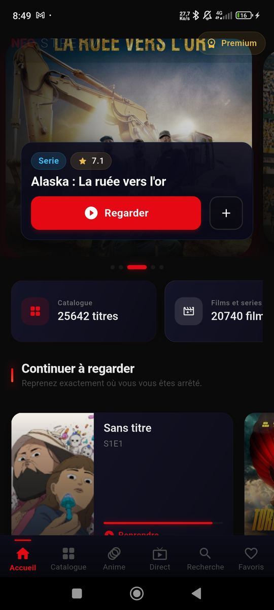</td>
      <td>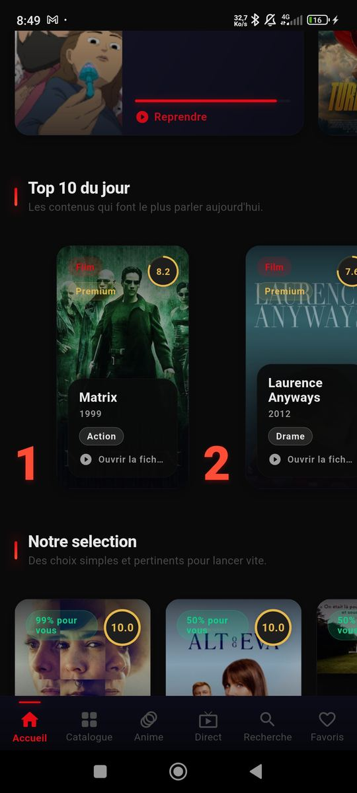</td>
    </tr>
    <tr>
      <td align="center"><b>📂 Catalogue — grille</b></td>
      <td align="center"><b>📂 Catalogue — sélection</b></td>
    </tr>
    <tr>
      <td>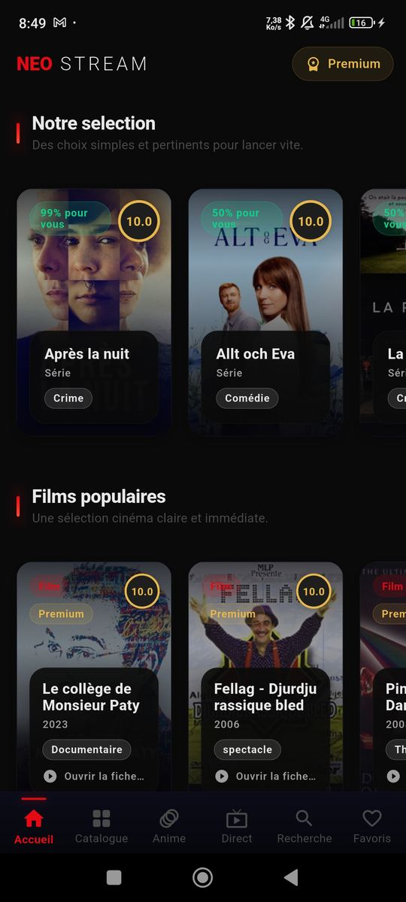</td>
      <td>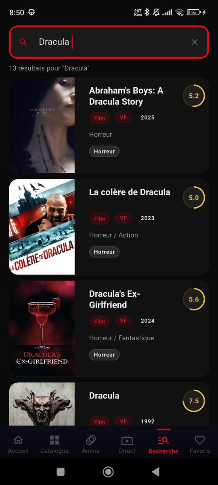</td>
    </tr>
    <tr>
      <td align="center"><b>🎬 Fiche — synopsis & épisodes</b></td>
      <td align="center"><b>▶️ Lecteur vidéo</b></td>
    </tr>
    <tr>
      <td>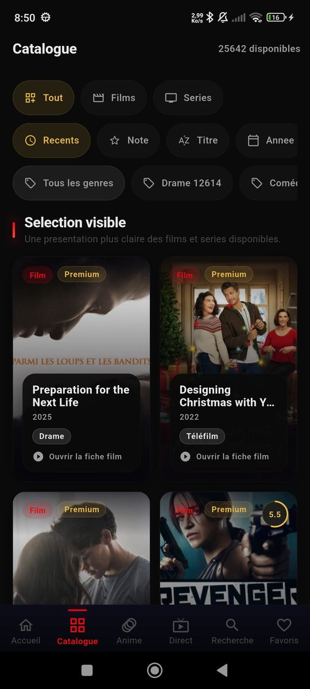</td>
      <td>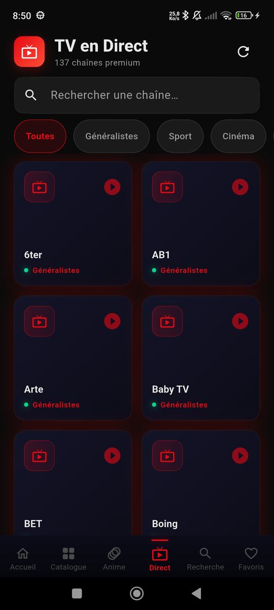</td>
    </tr>
    <tr>
      <td align="center"><b>📺 Lecture — épisodes</b></td>
      <td align="center"><b>🎌 Anime — bibliothèque</b></td>
    </tr>
    <tr>
      <td>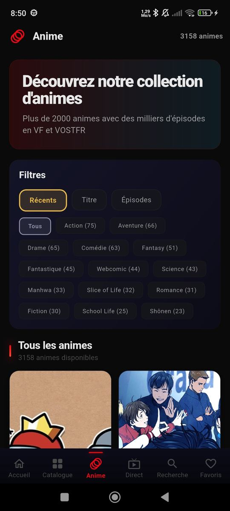</td>
      <td>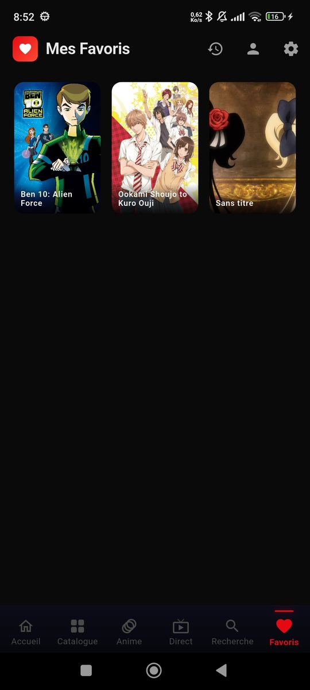</td>
    </tr>
    <tr>
      <td align="center"><b>🎌 Anime — en cours</b></td>
      <td align="center"><b>📺 Direct — chaînes TV</b></td>
    </tr>
    <tr>
      <td>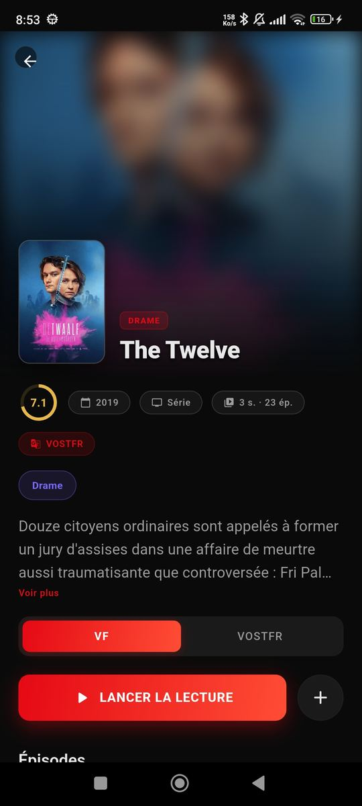</td>
      <td>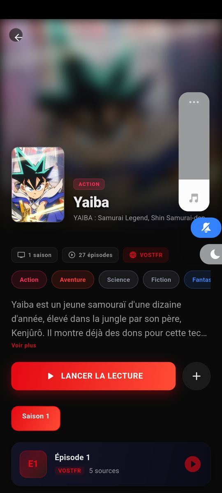</td>
    </tr>
    <tr>
      <td align="center"><b>🔍 Recherche</b></td>
      <td align="center"><b>👤 Profil & paramètres</b></td>
    </tr>
    <tr>
      <td>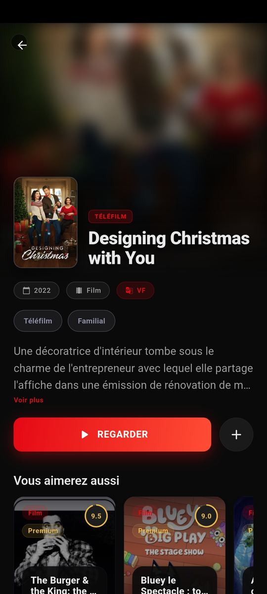</td>
      <td>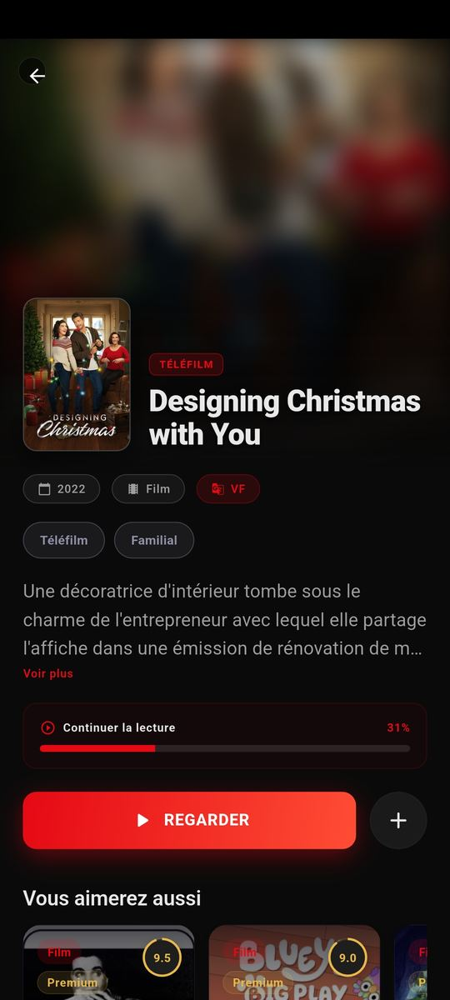</td>
    </tr>
  </table>
</div>

> Les captures proviennent du site [neo-stream.eu](https://neo-stream.eu/app.html) et sont hébergées dans le dossier `screenshots/` du repo.

---

## ✨ Fonctionnalités

| Fonctionnalité | Description |
|---|---|
| 🎬 **Catalogue complet** | Films, séries et anime avec fiches détaillées, saisons, épisodes |
| 📺 **TV en direct** | Chaînes IPTV HD françaises via proxy FSTV (option premium) |
| 📥 **Téléchargements hors-ligne** | Films, épisodes, saisons ou séries entières — extraction intégrée, lecture hors-ligne (v1.4.0) |
| ⏭️ **Épisode suivant auto** | Enchaînement façon Netflix avec compte à rebours (v1.4.0) |
| ⏩ **Vitesse de lecture** | 0.5x → 2x mémorisée + minuteur de sommeil (v1.4.0) |
| ▶️ **Lecteur universel** | ExoPlayer natif (Android), media_kit (Windows/Linux), fallback automatique multi-sources + sélecteur de source intégré |
| 🚫 **Zéro pub** | Extraction côté client vers URL directe HLS/MP4 sur 15+ hébergeurs, filtre anti-faux-flux (v1.4.0) |
| 🔄 **Reprise auto** | Continue exactement où tu t'es arrêté, synchronisé sur tous tes appareils |
| 🔍 **Recherche avancée** | Historique local + filtres Films / Séries / Anime / ⭐ 7+ (v1.4.0) |
| 📡 **Catalogue hors-ligne** | Cache local — l'accueil reste instantané, même sans réseau (v1.4.0) |
| ❤️ **Favoris & historique** | Bibliothèque personnelle et historique de visionnage |
| 👤 **Multi-profils** | Jusqu'à 4 sous-comptes par compte |
| 🤖 **Recherche IA** | Recherche en langage naturel optionnelle |
| 📱 **Multi-plateforme** | Android, Android TV (D-pad), Windows, Linux — même compte partout |
| 🎨 **Design glassmorphisme** | Thème clair/sombre adaptatif, couleurs par genre, animations fluides |
| 🔄 **Mises à jour auto** | Vérification via GitHub Releases, téléchargement intégré |

---

## 📥 Installation

### Téléchargement direct

| Plateforme | Format | Lien |
|---|---|---|
| 📱 Android | APK universel | [Télécharger](https://github.com/pecorio-dev/Neo-Stream/releases/latest) |
| 📺 Android TV | APK (navigation D-pad) | [Télécharger](https://github.com/pecorio-dev/Neo-Stream/releases/latest) |
| 🖥️ Windows 10/11 | Installateur `.exe` (Inno Setup) | [Télécharger](https://github.com/pecorio-dev/Neo-Stream/releases/latest) |
| 🐧 Linux | AppImage / `.deb` (Debian, Ubuntu…) / `.tar.gz` | [Télécharger](https://github.com/pecorio-dev/Neo-Stream/releases/latest) |

> L'application se met à jour automatiquement via GitHub Releases.

---

## 🏗️ Architecture

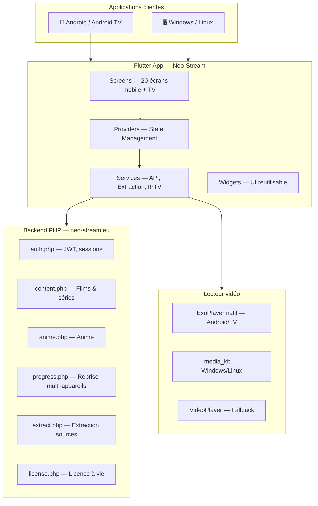
```mermaid
graph TB
    subgraph CLIENT["Applications clientes"]
        A[📱 Android / Android TV]
        B[🖥️ Windows / Linux]
    end

    subgraph APP["Flutter App — Neo-Stream"]
        D[Screens — 20 écrans mobile + TV]
        E[Providers — State Management]
        F[Services — API, Extraction, IPTV]
        G[Widgets — UI réutilisable]
    end

    subgraph API["Backend PHP — neo-stream.eu"]
        I[auth.php — JWT, sessions]
        J[content.php — Films & séries]
        K[anime.php — Anime]
        L[progress.php — Reprise multi-appareils]
        M[extract.php — Extraction sources]
        N[license.php — Licence à vie]
    end

    subgraph PLAYER["Lecteur vidéo"]
        P1[ExoPlayer natif — Android/TV]
        P2[media_kit — Windows/Linux]
        P3[VideoPlayer — Fallback]
    end

    A & B --> APP
    APP --> E
    E --> F
    F --> API
    F --> PLAYER
```

### Flux de lecture

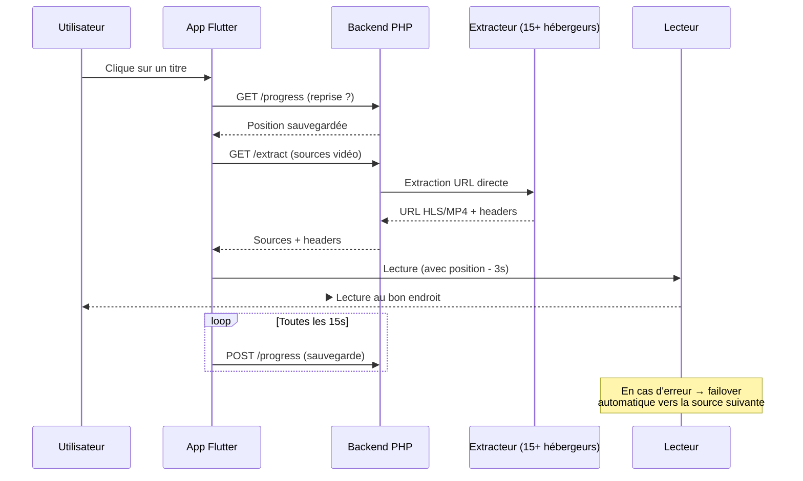
```mermaid
sequenceDiagram
    participant U as Utilisateur
    participant A as App Flutter
    participant API as Backend PHP
    participant EX as Extracteur (15+ hébergeurs)
    participant P as Lecteur

    U->>A: Clique sur un titre
    A->>API: GET /progress (reprise ?)
    API-->>A: Position sauvegardée
    A->>API: GET /extract (sources vidéo)
    API->>EX: Extraction URL directe
    EX-->>API: URL HLS/MP4 + headers
    API-->>A: Sources + headers
    A->>P: Lecture (avec position - 3s)
    P-->>U: ▶️ Lecture au bon endroit
    loop Toutes les 15s
        A->>API: POST /progress (sauvegarde)
    end
    note over P: En cas d'erreur → failover<br/>automatique vers la source suivante
```

---

## 🔧 Stack technique

| Couche | Technologies |
|---|---|
| **Frontend** | Flutter 3.32, Dart 3.x |
| **Lecteur vidéo** | ExoPlayer (Android), media_kit (Windows/Linux), videoPlayer (fallback) |
| **State management** | Provider |
| **Backend** | PHP 8.x, JWT, MySQL |
| **IPTV** | Proxy FSTV, chaînes HD françaises |
| **CI/CD** | GitHub Actions (build multi-plateforme auto) |
| **Distribution** | GitHub Releases, Inno Setup (Windows), AppImage (Linux) |

### Dépendances clés

| Package | Rôle |
|---|---|
| `media_kit` | Lecteur vidéo natif cross-platform |
| `provider` | Gestion d'état |
| `cached_network_image` | Images avec cache |
| `flutter_secure_storage` | Tokens JWT sécurisés |
| `shimmer` | Skeletons de chargement |
| `flutter_animate` | Animations fluides |
| `wakelock_plus` | Maintien écran allumé |
| `url_launcher` | Ouverture liens externes |

---

## 🔨 Build depuis les sources

### Prérequis
- Flutter 3.32+ (`flutter --version`)
- JDK 17 (pour Android)
- Linux : `libmpv-dev libgtk-3-dev ninja-build cmake clang pkg-config`

```bash
# Cloner
git clone https://github.com/pecorio-dev/Neo-Stream.git
cd Neo-Stream/app/app

# Dépendances
flutter pub get

# Build de développement
flutter run

# Builds release
flutter build apk --release        # Android
flutter build windows --release    # Windows
flutter build linux --release      # Linux
```

### Build Windows (installateur)
```bash
cd app
iscc neo_stream_setup.iss   # → app/installer/NeoStream-Setup-*.exe
```

---

## 📂 Structure du projet

```
Neo-Stream/
├── .github/workflows/        → CI/CD (build-all, build-windows, release)
├── app/
│   ├── app/                  → Application Flutter
│   │   ├── lib/
│   │   │   ├── config/       → Thème, constantes, config TV
│   │   │   ├── models/       → Content, Anime, User, SubAccount
│   │   │   ├── providers/    → Theme, Auth, Content, Update
│   │   │   ├── screens/      → 20+ écrans (mobile + TV), Téléchargements
│   │   │   │   └── tv/       → Interface dédiée Android TV
│   │   │   ├── services/     → API, VideoExtractor, AnimeExtractor, FSTV, AI Search,
│   │   │   │                  DownloadService, SearchHistory, PlayerPrefs
│   │   │   ├── utils/        → TVDetector, Semver, helpers
│   │   │   └── widgets/      → ContentCard, HeroBanner, Shimmer, DownloadButton, etc.
│   │   ├── assets/           → Icônes, logo, images
│   │   └── pubspec.yaml      → Dépendances (v1.4.0)
│   ├── neo_stream_setup.iss  → Script Inno Setup (Windows)
│   └── CHANGELOG.md
├── screenshots/              → Captures d'écran (utilisées par neo-stream.eu)
└── README.md
```

---

## 💎 Tarif

> **10 € — une seule fois — accès à vie.**

Le prix d'un mois sur n'importe quelle autre plateforme. Ici, c'est pour toujours.

Paiement sécurisé via PayPal directement depuis l'app. Une fois validé, ton compte est déverrouillé définitivement sur tous tes appareils. Sans engagement, sans renouvellement.

L'accès aux films, séries et anime est **100% gratuit**. Seule la TV en direct (IPTV) est une option premium.

---

## 👨‍💻 À propos

Je m'appelle **p3cori0**, j'ai 17 ans, et Neo-Stream est le projet le plus important de ma vie jusqu'ici.

Il y a deux ans, je ne savais pas coder. Zéro. Rien. J'avais une idée — une vraie plateforme de streaming, propre, sans pub, accessible — et aucun moyen de la construire. Alors j'ai appris. Le vibe coding d'abord, puis ligne par ligne, puis l'aide de l'IA pour aller plus vite. Deux ans de soirées, de weekends, de recommencements.

Ma mère me répète que je perds mon temps avec ce projet. Je n'ai pas arrêté.

Parce que le but de Neo-Stream, c'est simple : **casser les codes**. Pourquoi regarder un film doit coûter 13 €/mois, afficher des pubs, et te bloquer sur une seule plateforme ? Une contribution minuscule — 10 € une seule fois — pour des films, séries et anime en 720p/1080p, sans pub, sur tous tes appareils.

Neo-Stream existe, il tourne, des gens l'utilisent. Et ça, personne ne peut me l'enlever.

---

## 🤝 Soutenir le projet

- ⭐ **Star le repo** — c'est gratuit et ça aide énormément
- 🐛 **Signale un bug** via les [Issues](https://github.com/pecorio-dev/Neo-Stream/issues)
- 💬 **Parle-en** autour de toi — le meilleur marketing
- 💰 **Achète une licence** (10 € à vie) sur [neo-stream.eu](https://neo-stream.eu)

---

## 📜 Changelog

Voir [app/CHANGELOG.md](app/CHANGELOG.md) pour l'historique complet.

| Version | Date | Highlights |
|---|---|---|
| v1.4.0 (pré-release) | 08/08/2026 | **Téléchargements hors-ligne** (films/séries/anime), épisode suivant auto façon Netflix, sélecteur de source dans le lecteur, vitesse 0.5-2x mémorisée, minuteur de sommeil, recherche avancée (historique + filtres), catalogue hors-ligne, fix blanc-sur-blanc (~40 cas), live TV anti-coupure, filtre anti-faux-flux, API accueil ~20-40x plus rapide |
| v1.3.2 | 29/07/2026 | Fix focus recherche TV, extraction vidéo, lecteur, favoris, perfs, screenshots |
| v1.3.1 | 27/07/2026 | Migration Android TV ExoPlayer, fallback multi-source, correctifs IPTV |
| v1.2.2 | 19/07/2026 | Fix carousel thème clair, stop re-extraction Sibnet |
| v1.2.1 | 11/07/2026 | Fix thème clair illisible, stop re-extraction Sibnet |
| v1.0.0 | 13/05/2026 | Première version publique (Windows, Android, Android TV) |

---

<div align="center">

**Fait avec trop de café et beaucoup d'obstination** par [p3cori0](https://github.com/pecorio-dev) · 17 ans · France

*"Commence. Le reste vient."*

</div>
